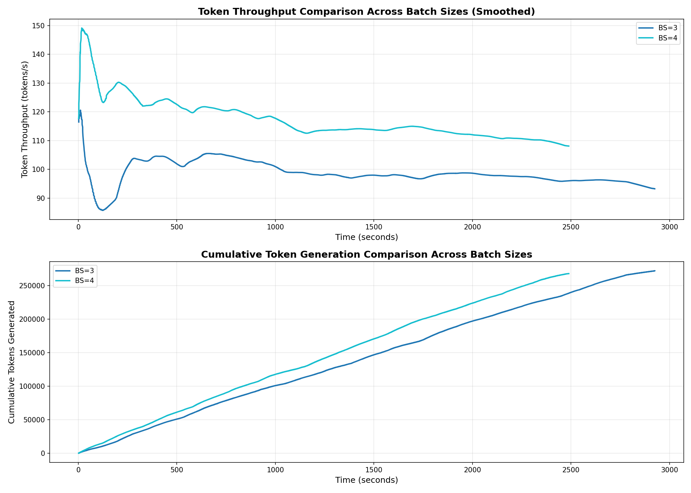
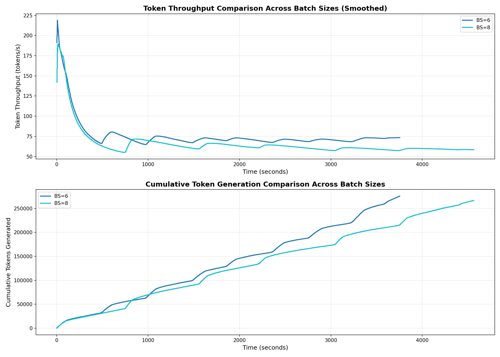

# CS885 Course Project: LLM Inference Performance Optimization

## Project Overview

This project benchmarks Large Language Model (LLM) inference performance in multi-turn dialogue scenarios, focusing on the impact of **Stateful KV Cache** optimization on throughput. We use the SGLang framework with the Qwen2.5-14B model.

### Core Optimization Techniques

- **Stateful KV Cache**: Runtime maintains KV state, avoiding repeated prefill for each turn
- **Prefix Caching**: Automatically reuses shared prefixes to improve cache hit rate
- **Dynamic Batching**: Dynamically adjusts concurrent request batch sizes
- **Memory Optimization**: Increases memory utilization to 88% (default 80%)

## Experimental Setup

### Model & Hardware
- **Model**: Qwen2.5-14B (128k context window)
- **GPU**: NVIDIA A100 (3 GPUs tested independently)
- **Framework**: SGLang >= 0.5.5

### Test Configuration
- **Trajectories**: 50 trajectories
- **Dialogue Turns**: 50 turns per trajectory
- **Batch Sizes**: 
  - GPU 1: [3, 4]
  - GPU 2: [6, 8]
  - GPU 3: [12, 16]

### Optimization Parameters
```python
mem_fraction_static = 0.88      # Memory utilization
max_total_tokens = 131072       # KV cache capacity (128k)
```

## Experimental Results

### GPU 1 (Batch Size 3-4)

| Batch Size | Total Time (s) | Avg/Traj (s) | Traj Throughput (traj/s) | Token Throughput (tok/s) | Total Tokens | Tok/Turn |
|-----------|---------------|-------------|------------------------|------------------------|-------------|---------|
| 4         | 2488.72       | 49.77       | 0.020                  | **107.74**             | 268,144     | 107.3   |
| 3         | 2925.08       | 58.50       | 0.017                  | 93.10                  | 272,314     | 108.9   |

**Best Configuration**: BS=4
- ✅ Highest token throughput: **107.74 tok/s**
- ✅ Highest trajectory throughput: **0.020 traj/s**
- ✅ Fastest per trajectory: **49.77 s/traj**

### GPU 2 (Batch Size 6-8)

| Batch Size | Total Time (s) | Avg/Traj (s) | Traj Throughput (traj/s) | Token Throughput (tok/s) | Total Tokens | Tok/Turn |
|-----------|---------------|-------------|------------------------|------------------------|-------------|---------|
| 8         | 4564.09       | 91.28       | 0.011                  | 58.39                  | 266,519     | 106.6   |
| 6         | 3753.39       | 75.07       | 0.013                  | **73.42**              | 275,579     | 110.2   |

**Best Configuration**: BS=6
- ✅ Highest token throughput: **73.42 tok/s**
- ✅ Highest trajectory throughput: **0.013 traj/s**
- ✅ Fastest per trajectory: **75.07 s/traj**

### Key Findings

1. **Optimal Batch Size is Not Always Larger**
   - GPU 1: BS=4 outperforms BS=3 (+15.7% throughput)
   - GPU 2: BS=6 outperforms BS=8 (+25.7% throughput)
   - Reason: Excessive batch size increases memory pressure and scheduling overhead

2. **Significant Token Throughput Variance**
   - GPU 1 (BS=4): 107.74 tok/s
   - GPU 2 (BS=6): 73.42 tok/s
   - GPU 1 is **46.8% faster** than GPU 2
   - Possible causes: Hardware differences, memory bandwidth, scheduling policies

3. **Stateful KV Cache Benefits**
   - Avoids per-turn full prefill, saving >99% of prefill computation
   - First turn does full prefill, subsequent turns only decode new tokens
   - Theoretical throughput improvement: 3-4x (vs. naive implementation)

## Performance Visualizations

We provide detailed performance visualizations for each GPU configuration:

### GPU 1 Batch Size Comparison


Individual plots:
- [Batch Size 3](plots/gpu1/batch_size_3.png)
- [Batch Size 4](plots/gpu1/batch_size_4.png)

### GPU 2 Batch Size Comparison


Individual plots:
- [Batch Size 6](plots/gpu2/batch_size_6.png)
- [Batch Size 8](plots/gpu2/batch_size_8.png)

## Quick Start

### 1. Environment Setup

```bash
# Create virtual environment
python -m venv .venv
source .venv/bin/activate  # Linux/Mac
# or .venv\Scripts\activate  # Windows

# Install dependencies
pip install -r requirements.txt
```

### 2. Prepare Data

Place your training data in the project root:
```
20250826_070310_MULTI_xiancai-80_swe_verified_train_0_5000.jsonl
```

**Note**: Data file is large (660MB) and excluded from git via `.gitignore`

### 3. Run Benchmark

```bash
# GPU 1, Batch Size 3-4
CUDA_VISIBLE_DEVICES=1 python src/benchmark_per_turn.py \
  --gpu 1 \
  --turns 50 \
  --num_traj 50 \
  --batch_sizes "3,4"

# GPU 2, Batch Size 6-8
CUDA_VISIBLE_DEVICES=2 python src/benchmark_per_turn.py \
  --gpu 2 \
  --turns 50 \
  --num_traj 50 \
  --batch_sizes "6,8"
```

### 4. Generate Visualizations

```bash
# Generate plots for GPU 1 results
python src/plot_metrics.py results/per_turn_metrics_gpu1_50traj_50turns_bs4_3.jsonl \
  --output_dir plots/gpu1

# Generate plots for GPU 2 results
python src/plot_metrics.py results/per_turn_metrics_gpu2_50traj_50turns_bs8_6.jsonl \
  --output_dir plots/gpu2
```

### 5. View Results

After testing, you'll find:
- `results/per_turn_metrics_gpu{N}_*.jsonl`: Detailed per-turn metrics
- `results/per_turn_summary_gpu{N}_*.json`: Summary results
- `plots/gpu{N}/`: Performance visualization plots
- `logs/`: Execution logs

## Project Structure

```
.
├── README.md                          # This file
├── requirements.txt                   # Python dependencies
├── .gitignore                         # Git ignore rules
│
├── src/                               # Source code
│   ├── benchmark_per_turn.py          # Main benchmark (Stateful KV Cache)
│   ├── benchmark_with_metrics.py      # Benchmark with metrics recording
│   ├── benchmark_realtime_metrics.py  # Real-time metrics monitoring
│   ├── concurrent_benchmark.py        # Concurrent comparison tests
│   ├── plot_metrics.py                # Visualization script
│   └── ...                            # Other experiment scripts
│
├── results/                           # Test results
│   ├── per_turn_metrics_*.jsonl       # Detailed metrics (per-turn records)
│   ├── per_turn_summary_*.json        # Summary results
│   └── ...
│
├── logs/                              # Execution logs
│   ├── BENCHMARK_PER_TURN_GPU1_BS34.log
│   ├── BENCHMARK_PER_TURN_GPU2_BS68.log
│   └── ...
│
├── plots/                             # Performance visualizations
│   ├── gpu1/                          # GPU 1 plots
│   │   ├── batch_size_3.png
│   │   ├── batch_size_4.png
│   │   └── batch_size_comparison.png
│   ├── gpu2/                          # GPU 2 plots
│   │   └── ...
│   └── ...
│
├── archive/                           # Historical versions and experiments
│   ├── BENCHMARK_REPORT.md
│   ├── PROJECT_SUMMARY.md
│   └── ...
│
└── 20250826_*.jsonl                   # Training data (excluded from git)
```

## Core Code Explanation

### Stateful KV Cache Implementation

```python
@sgl.function
def rollout_trajectory_stateful(s, system_msg, first_user_msg, observations, num_turns):
    """
    Define entire multi-turn dialogue flow at once
    Runtime automatically maintains KV cache state
    """
    # Initial context (only prefill once)
    s += sgl.system(system_msg)
    s += sgl.user(first_user_msg)
    
    # Multi-turn dialogue (append new content each turn)
    for turn_idx in range(num_turns):
        s += sgl.assistant(sgl.gen(
            f"response_{turn_idx}",
            max_tokens=256,
            temperature=0.7,
            stop=["<|im_end|>", "\n\nUSER:"]
        ))
        
        if turn_idx < len(observations):
            s += sgl.user(observations[turn_idx])
```

### Runtime Configuration

```python
runtime = sgl.Runtime(
    model_path=MODEL_PATH,
    tp_size=1,
    mem_fraction_static=0.88,    # Increase memory utilization
    max_total_tokens=131072,     # 128k KV cache
    port=30000 + gpu_id * 10     # Avoid port conflicts
)
```

## Performance Optimization Tips

1. **Batch Size Tuning**
   - Small models/short sequences: BS=4-6
   - Large models/long sequences: BS=2-4
   - Recommend testing small range first to find optimal point

2. **Memory Management**
   - `mem_fraction_static`: 0.85-0.90 (not too high to avoid OOM)
   - `max_total_tokens`: Adjust based on dialogue length

3. **Concurrency Strategy**
   - Use `ThreadPoolExecutor` to control concurrency
   - Avoid excessive concurrency causing GPU starvation

4. **Monitoring Metrics**
   - Token throughput (tok/s)
   - Trajectory throughput (traj/s)
   - Average latency (s/traj)
   - Memory utilization

## Related Documentation

- [SGLang Official Documentation](https://github.com/sgl-project/sglang)
- [Qwen2.5 Model](https://github.com/QwenLM/Qwen2.5)
- `archive/BENCHMARK_REPORT.md`: Detailed experiment report
- `archive/PROJECT_SUMMARY.md`: Project summary

## Dependencies

```
sglang >= 0.5.5
torch >= 2.8.0
transformers >= 4.57.1
matplotlib >= 3.5.0
numpy >= 1.21.0
```

## License

MIT License

## Authors

CS885 Course Project - 2025

## Acknowledgments

- SGLang team for the high-performance inference framework
- Qwen team for the open-source model
